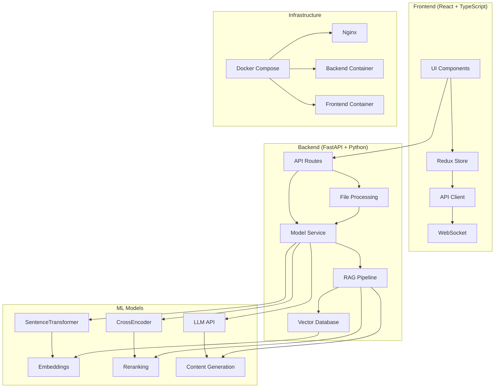

# 🚀 AI Presentation Generator

<div align="center">


**Интеллектуальная система генерации презентаций на основе ИИ с RAG-архитектурой**

[📖 Документация](#-документация) • [🚀 Быстрый старт](#-быстрый-старт) • [🏗️ Архитектура](#️-архитектура) • [🤖 ML Модели](#-ml-модели) • [📊 API](#-api)

</div>

---

## 📋 Оглавление

- [🎯 Описание проекта](#-описание-проекта)
- [✨ Основные возможности](#-основные-возможности)
- [🏗️ Архитектура](#️-архитектура)
- [🤖 ML Модели](#-ml-модели)
- [🚀 Быстрый старт](#-быстрый-старт)
- [📦 Установка зависимостей](#-установка-зависимостей)
- [⚙️ Конфигурация](#️-конфигурация)
- [🔧 Разработка](#-разработка)
- [🐳 Docker](#-docker)
- [📊 API](#-api)
- [🎨 Frontend](#-frontend)
- [🔧 Backend](#-backend)
- [📁 Структура проекта](#-структура-проекта)
- [🤝 Вклад в проект](#-вклад-в-проект)
- [📄 Лицензия](#-лицензия)

---

## 🎯 Описание проекта

**AI Presentation Generator** — это полнофункциональная система для автоматической генерации презентаций с использованием искусственного интеллекта. Проект объединяет современные технологии машинного обучения, веб-разработки и обработки документов для создания интеллектуального инструмента создания презентаций.

### 🎨 Ключевые особенности

- **🧠 ИИ-генерация контента** - Автоматическое создание слайдов на основе загруженных документов
- **📄 RAG-архитектура** - Retrieval-Augmented Generation для точной работы с контекстом
- **🎭 Адаптивные темы** - Различные визуальные темы для разных типов аудитории
- **✏️ Интерактивное редактирование** - Возможность редактирования слайдов в реальном времени
- **📊 Автоматическая визуализация** - Генерация диаграмм и графиков на основе данных
- **🌐 Современный UI** - React + Material-UI интерфейс с анимациями

---

## ✨ Основные возможности

### 🎯 Генерация презентаций
- **Классификация аудитории** - Автоматическое определение типа аудитории (TopManagement, Experts, Investors)
- **Планирование структуры** - ИИ создает оптимальную структуру презентации
- **Контекстная генерация** - Использование загруженных документов для создания релевантного контента

### 📝 Редактирование слайдов
- **Множественные действия** - Polish, Correct, Translate, Expand, Shorten, Simplify, Specify
- **Пользовательские промпты** - Возможность задать собственные инструкции
- **Визуальное редактирование** - Drag & Drop интерфейс для перестановки блоков

### 📊 Визуализация данных
- **Автоматические диаграммы** - Генерация bar, line, pie charts на основе данных
- **Интерактивные графики** - Использование Chart.js для создания интерактивных элементов
- **Адаптивные темы** - Различные цветовые схемы и стили

---

## 🏗️ Архитектура



### 🔄 Поток данных

1. **Загрузка документа** → Обработка файла → Извлечение текста
2. **Создание эмбеддингов** → Векторизация → Сохранение в Qdrant
3. **Пользовательский запрос** → Классификация аудитории → Планирование структуры
4. **Генерация контента** → RAG поиск → LLM генерация → Создание слайдов
5. **Редактирование** → Пользовательские действия → Регенерация контента

---

## 🤖 ML Модели

### 📊 Используемые модели

| Модель | Назначение | Размер | Производительность |
|--------|------------|--------|-------------------|
| **BAAI/bge-m3** | Embeddings для RAG | ~1.2GB | 1024 dim |
| **cross-encoder/ms-marco-MiniLM-L-6-v2** | Reranking результатов | ~80MB | Fast inference |
| **OpenRouter API** | LLM для генерации | Cloud | Various models |

### 🔧 Конфигурация моделей

```python
# Настройки по умолчанию
DEFAULT_EMBEDDING_MODEL = "BAAI/bge-m3"
CROSS_ENCODER_MODEL = "cross-encoder/ms-marco-MiniLM-L-6-v2"
DEFAULT_MODEL = "moonshotai/kimi-k2-0905"  # OpenRouter
```

### 🚀 Поддерживаемые LLM модели

- `moonshotai/kimi-k2-0905` - Основная модель
- `openai/gpt-oss-120b` - Альтернативная
- `google/gemma-3-12b-it` - Google Gemma

---

## 🚀 Быстрый старт

### 📋 Предварительные требования

- **Docker** и **Docker Compose**
- **Node.js** 18+ (для разработки)
- **Python** 3.11+ (для разработки)
- **Git**

### ⚡ Запуск через Docker

```bash
# Клонирование репозитория
git clone <repository-url>
cd <repository-name>

# Создание .env файлов
cp backend/.env.example backend/.env
cp frontend/.env.example frontend/.env

# Запуск всех сервисов
docker-compose up --build
```

### 🌐 Доступ к приложению

- **Frontend**: http://localhost:3000
- **Backend API**: http://localhost:8000
- **API Documentation**: http://localhost:8000/docs

---

## 📦 Установка зависимостей

### 🐍 Backend (Python)

```bash
cd backend

# Создание виртуального окружения
python -m venv venv
source venv/bin/activate  # Linux/Mac
# или
venv\Scripts\activate     # Windows

# Установка зависимостей
pip install -r requirements.txt
```

### ⚛️ Frontend (Node.js)

```bash
cd frontend

# Установка зависимостей
npm install

# Запуск в режиме разработки
npm start
```

---

## ⚙️ Конфигурация

### 🔑 Переменные окружения

#### Backend (.env)
```env
# API Keys
OPENROUTER_API_KEY=your_openrouter_key
OPENAI_API_KEY=your_openai_key  # опционально

# Model Configuration
DEFAULT_MODEL=moonshotai/kimi-k2-0905
DEFAULT_EMBEDDING_MODEL=BAAI/bge-m3
CROSS_ENCODER_MODEL=cross-encoder/ms-marco-MiniLM-L-6-v2

# File Processing
TEMPFILE_DIR=./tempfiles
TEMPFILE_CLEANUP_INTERVAL_SECONDS=3600

# Environment
ENVIRONMENT=production
```

#### Frontend (.env)
```env
REACT_APP_API_URL=http://localhost:8000/api
REACT_APP_WS_URL=ws://localhost:8000/ws
```

### 🎛️ Настройки модели

```python
# backend/src/config.py
class ModelSettings:
    MIN_SLIDES = 10
    MAX_SLIDES = 15
    TOP_K_RETRIEVAL = 5
    CHUNK_SIZE = 512
    CHUNK_OVERLAP = 50
    GEN_TEMPERATURE = 0.2
```

---

## 🔧 Разработка

### 🚀 Локальная разработка

#### Backend
```bash
cd backend
python -m src.preload  # Предзагрузка моделей
uvicorn src.main:app --reload --host 0.0.0.0 --port 8000
```

#### Frontend
```bash
cd frontend
npm start
```

### 📊 Мониторинг

- **Логи**: Структурированные логи с уровнем INFO
- **Метрики**: Время генерации, использование памяти
- **Health Check**: `/api/health` endpoint

---

## 🐳 Docker

### 🏗️ Сборка образов

```bash
# Backend
docker build -t ai-presentation-backend ./backend

# Frontend
docker build -t ai-presentation-frontend ./frontend
```

### 🚀 Docker Compose

```yaml
version: '3.8'
services:
  nginx:
    image: nginx:alpine
    ports: ["80:80", "443:443"]
    depends_on: [backend, frontend]
  
  frontend:
    build: ./frontend
    environment:
      - NODE_ENV=production
  
  backend:
    build: ./backend
    environment:
      - ENVIRONMENT=production
    volumes:
      - models_cache:/models_cache
```

### 📁 Volumes

- `models_cache` - Кэш для ML моделей
- `tempfiles` - Временные файлы
- `certbot` - SSL сертификаты

---

## 📊 API

### 🎯 Основные эндпоинты

#### Генерация презентации
```http
POST /api/presentation/generate
Content-Type: multipart/form-data

text: "Описание презентации"
file: [uploaded file]
model: "moonshotai/kimi-k2-0905"
```

#### Редактирование слайда
```http
POST /api/presentation/edit
Content-Type: application/json

{
  "text": "Новый текст слайда",
  "slide": {...},
  "action": "polish",
  "model": "moonshotai/kimi-k2-0905"
}
```

#### Получение файла
```http
GET /api/files/{filename}
```

### 📋 Схемы данных

#### GeneratePresInSchema
```python
{
  "text": str,      # Описание презентации
  "model": str      # Модель LLM
}
```

#### EditSlideInSchema
```python
{
  "text": str,      # Новый текст
  "slide": dict,    # Данные слайда
  "action": str,    # Действие (polish, correct, etc.)
  "model": str      # Модель LLM
}
```

---

## 🎨 Frontend

### 🏗️ Архитектура

```
src/
├── app/                    # Redux store и конфигурация
├── features/              # Основные функции
│   ├── MarkdownPresentation/  # Компоненты презентации
│   ├── AiChat/               # Чат с ИИ
│   ├── BlockGeneration/      # Генерация блоков
│   └── PromptSend/           # Отправка промптов
├── pages/                 # Страницы приложения
├── shared/                # Общие компоненты и утилиты
└── index.tsx             # Точка входа
```

### 🎨 Технологии

- **React 19.2.0** - Основной фреймворк
- **TypeScript** - Типизация
- **Material-UI** - UI компоненты
- **Redux Toolkit** - Управление состоянием
- **Framer Motion** - Анимации
- **Chart.js** - Графики и диаграммы
- **React Router** - Маршрутизация

### 🎭 Темы и стилизация

```typescript
interface Theme {
  id: string;
  name: string;
  colors: {
    background: string;
    heading: string;
    paragraph: string;
    backgroundImages?: string[];
  };
}
```

---

## 🔧 Backend

### 🏗️ Архитектура

```
src/
├── main.py              # FastAPI приложение
├── config.py            # Конфигурация
├── preload.py           # Предзагрузка моделей
├── modules/             # Основные модули
│   └── models/          # ML модели и RAG
├── routes/              # API маршруты
├── services/            # Бизнес-логика
├── schemas/             # Pydantic схемы
└── utils/               # Утилиты
```

### 🔄 RAG Pipeline

1. **Document Processing** - Обработка загруженных файлов
2. **Chunking** - Разбиение на фрагменты (512 токенов)
3. **Embedding** - Создание векторных представлений
4. **Storage** - Сохранение в Qdrant
5. **Retrieval** - Поиск релевантных фрагментов
6. **Reranking** - Переранжирование с CrossEncoder
7. **Generation** - Создание контента с LLM

### 📊 Обработка файлов

Поддерживаемые форматы:
- **PDF** - pdfplumber, PyMuPDF
- **DOCX** - python-docx
- **PPTX** - python-pptx
- **TXT** - Прямая обработка
- **Markdown** - docx2md

---

## 📁 Структура проекта

```
AH-git/
├── 📁 backend/                 # Python FastAPI backend
│   ├── 📁 src/                # Исходный код
│   │   ├── 📁 modules/        # ML модули
│   │   ├── 📁 routes/         # API маршруты
│   │   ├── 📁 services/       # Бизнес-логика
│   │   └── 📁 schemas/        # Pydantic схемы
│   ├── 📁 local_models/       # Локальные ML модели
│   ├── 📁 tempfiles/          # Временные файлы
│   ├── 📄 Dockerfile          # Docker образ
│   └── 📄 requirements.txt    # Python зависимости
├── 📁 frontend/               # React TypeScript frontend
│   ├── 📁 src/                # Исходный код
│   │   ├── 📁 features/       # Основные функции
│   │   ├── 📁 pages/          # Страницы
│   │   └── 📁 shared/         # Общие компоненты
│   ├── 📄 Dockerfile          # Docker образ
│   └── 📄 package.json        # Node.js зависимости
├── 📁 nginx/                  # Nginx конфигурация
├── 📁 certbot/                # SSL сертификаты
├── 📄 docker-compose.yml      # Docker Compose
└── 📄 README.md               # Документация
```

---

## 🤝 Вклад в проект

### 🔧 Настройка для разработки

1. **Fork** репозитория
2. **Clone** вашей копии
3. Создайте **feature branch**
4. Внесите изменения
5. Создайте **Pull Request**

### 📝 Стандарты кода

- **Python**: PEP 8, Black formatter
- **TypeScript**: ESLint, Prettier
- **Commits**: Conventional Commits
- **Tests**: Покрытие > 80%

### 🐛 Сообщение об ошибках

Используйте GitHub Issues с шаблоном:
- Описание проблемы
- Шаги воспроизведения
- Ожидаемое поведение
- Логи и скриншоты

---

## 📄 Лицензия

Этот проект распространяется под лицензией **MIT**. См. файл [LICENSE](LICENSE) для подробностей.

---

<div align="center">

**Создано с ❤️ для автоматизации создания презентаций**

[🔗 GitHub](https://github.com/your-repo) • [📧 Email](mailto:your-email@example.com) • [🐛 Issues](https://github.com/your-repo/issues)

</div>
